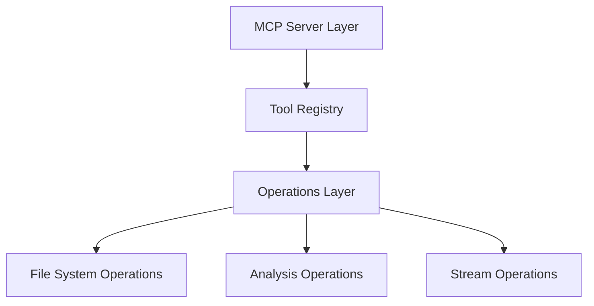

# Filesystem MCP Server

A Model Context Protocol (MCP) server implementation providing file system operations, analysis, and manipulation capabilities through a standardized tool interface.

## Architecture

The server is built on the MCP SDK and organized into distinct layers:



### Components
- **Server Layer**: Handles MCP protocol communication and tool dispatch
- **Tool Registry**: Manages tool registration and execution
- **Operations Layer**: Implements core functionality
- **File System Interface**: Provides safe file system access

## Installation

1. Clone the repository:
```bash
git clone <repository-url>
cd filesystem-server
```

2. Install dependencies:
```bash
npm install
```

3. Build the server:
```bash
npm run build
```

4. Configure MCP settings (cline_mcp_settings.json):
```json
{
  "mcpServers": {
    "filesystem": {
      "command": "node",
      "args": ["path/to/filesystem-server/build/index.js"]
    }
  }
}
```

## Tool Reference

### Directory Operations

#### list_directory
Lists directory contents with metadata.

```typescript
interface ListDirectoryParams {
    path: string;       // Directory path
    recursive?: boolean; // List recursively (default: false)
}

interface ListDirectoryResult {
    entries: {
        name: string;
        path: string;
        isDirectory: boolean;
        size: number;
        created: string;
        modified: string;
        accessed: string;
        mode: string;
    }[];
}
```

#### create_directory
Creates a new directory.

```typescript
interface CreateDirectoryParams {
    path: string;       // Directory path
    recursive?: boolean; // Create parent directories (default: true)
}
```

### File Operations

#### read_file
Reads file content with encoding support.

```typescript
interface ReadFileParams {
    path: string;     // File path
    encoding?: string; // File encoding (default: 'utf8')
}
```

#### write_file
Writes content to a file.

```typescript
interface WriteFileParams {
    path: string;     // File path
    content: string;  // Content to write
    encoding?: string; // File encoding (default: 'utf8')
}
```

#### append_file
Appends content to a file.

```typescript
interface AppendFileParams {
    path: string;     // File path
    content: string;  // Content to append
    encoding?: string; // File encoding (default: 'utf8')
}
```

### Analysis Operations

#### analyze_text
Analyzes text file properties.

```typescript
interface AnalyzeTextParams {
    path: string; // File path
}

interface AnalyzeTextResult {
    lineCount: number;
    wordCount: number;
    charCount: number;
    encoding: string;
    mimeType: string;
}
```

#### calculate_hash
Calculates file hash using specified algorithm.

```typescript
interface CalculateHashParams {
    path: string;           // File path
    algorithm?: 'md5' | 'sha1' | 'sha256' | 'sha512'; // Hash algorithm
}

interface CalculateHashResult {
    hash: string;
    algorithm: string;
}
```

#### find_duplicates
Identifies duplicate files in a directory.

```typescript
interface FindDuplicatesParams {
    path: string; // Directory path
}

interface FindDuplicatesResult {
    duplicates: {
        hash: string;
        size: number;
        files: string[];
    }[];
}
```

### Compression Operations

#### create_zip
Creates a ZIP archive.

```typescript
interface CreateZipParams {
    files: string[];  // Files to include
    output: string;   // Output ZIP path
}
```

#### extract_zip
Extracts a ZIP archive.

```typescript
interface ExtractZipParams {
    path: string;    // ZIP file path
    output: string;  // Output directory
}
```

## Error Handling

The server uses standard MCP error codes:

```typescript
enum ErrorCode {
    ParseError = -32700,
    InvalidRequest = -32600,
    MethodNotFound = -32601,
    InvalidParams = -32602,
    InternalError = -32603
}
```

Error responses include:
- Error code
- Human-readable message
- Additional context when available

Example error:
```json
{
    "code": -32602,
    "message": "File not found: /path/to/file.txt"
}
```

## Development

### Project Structure
```
src/
├── operations/     # Core operations implementation
├── tools/         # MCP tool definitions and handlers
├── __tests__/     # Test suites
├── index.ts       # Entry point
├── server.ts      # MCP server setup
├── types.ts       # Type definitions
└── utils.ts       # Utility functions
```

### Running Tests

Run the test suite:
```bash
npm test
```

Run with coverage:
```bash
npm run test:coverage
```

### Development Mode

Run in watch mode:
```bash
npm run watch
```

### Code Quality

Lint the codebase:
```bash
npm run lint
```

Type check:
```bash
npm run type-check
```

## Dependencies

Core dependencies:
- @modelcontextprotocol/sdk: MCP server implementation
- file-type: File type detection
- mime-types: MIME type lookup
- crypto-js: File hashing
- archiver: ZIP creation
- extract-zip: ZIP extraction
- iconv-lite: Text encoding
- chardet: Encoding detection

Development dependencies:
- typescript: Type system
- jest: Testing
- eslint: Linting
- prettier: Formatting
- ts-node: TypeScript execution
- nodemon: Development server

## Contributing

1. Fork the repository
2. Create your feature branch
3. Write tests for new features
4. Ensure all tests pass
5. Submit a pull request

## License

MIT